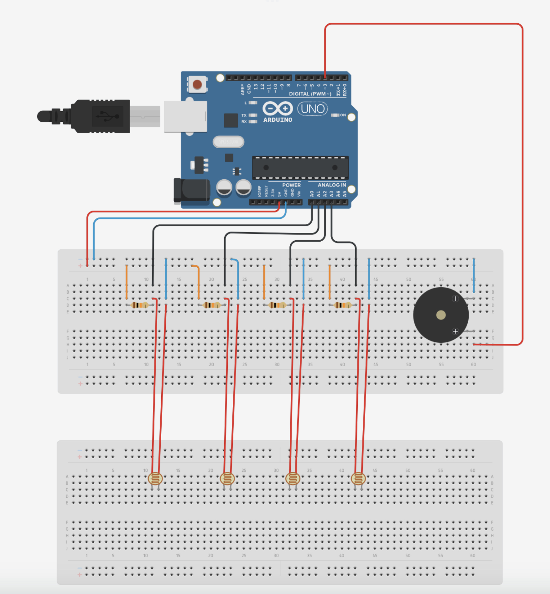
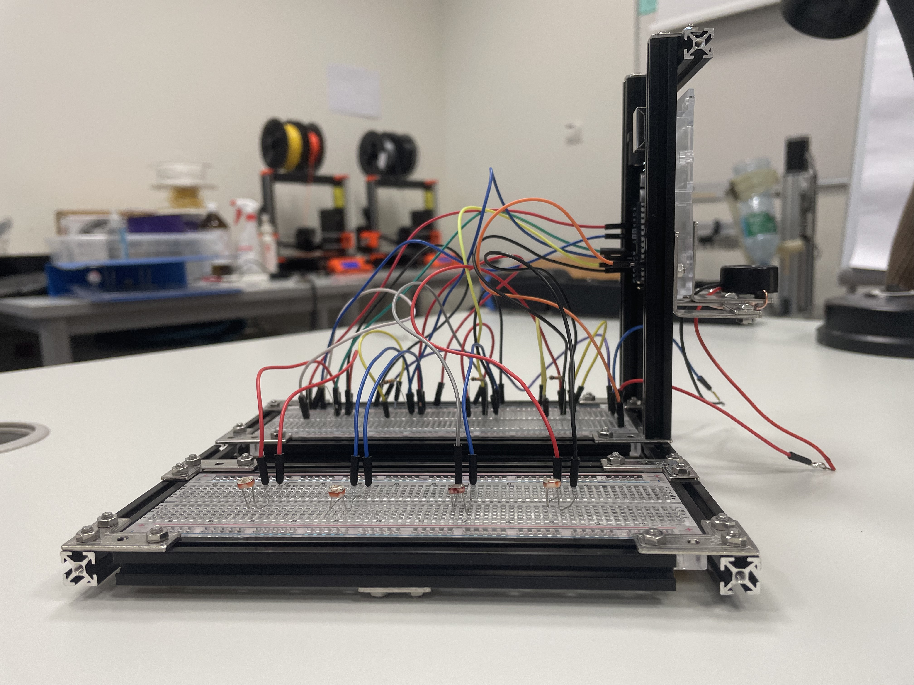
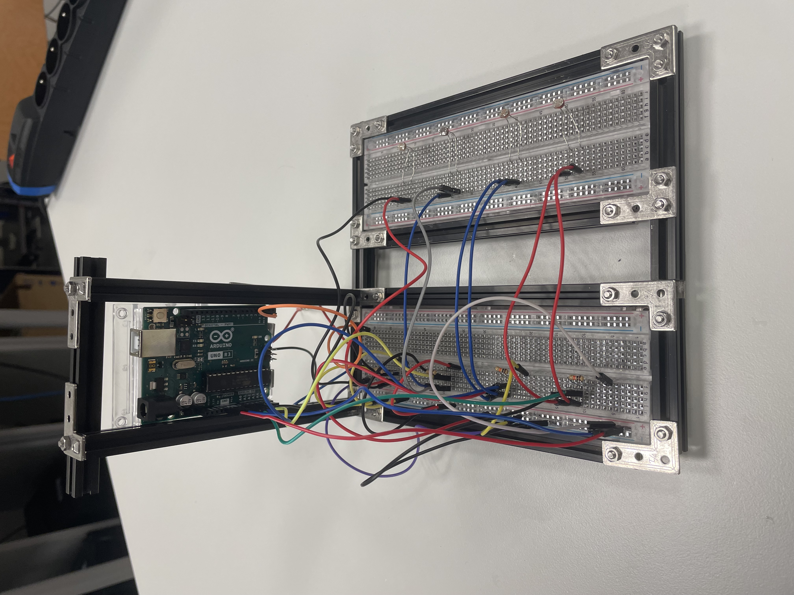
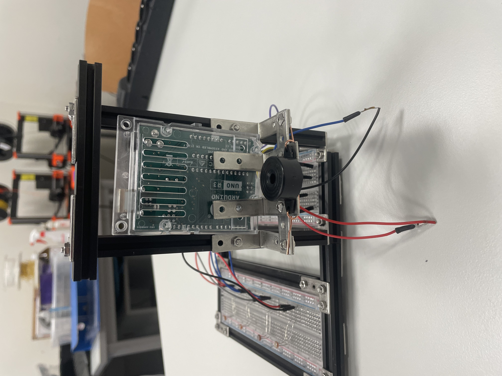

# Termenvox based on photoresistors

## Author:
Anastasiia Britan

## Description of the project

Termenvox based on photoresistors is a musical instrument, which can produce sounds by the differenciating intensity of light. Reglar termenvox uses the changes in magnetic field, so this is a completly different instrument, which looks a bit alike, but a player still do not have to touch the instrument to make it sound.

## Construction of the instrument

| Cicuit overview |
|  |

As a base for this projekt I used a scheme from the "experiment 4" (wiki.amperka.ru). I changed the construction to make it more sensitive to the light intensity.
All the electronic components, used in this project:
1) Arduino UNO
2) 4 photoresistors
3) 4 10kOhm resistors
4) 2 breadbords (one is enough, but I used two separate pieces to make the process of playing on the instrument easier)
5) 1 piezo dynamic
6) Connection wires

## Desing overview 
 
 
 

I also used some metallic constructions to make this instrument more durable, because electronic compotents are quite fragile.

## How it works?

By commands map and tone we can set a range of frequencies, assosiated with different amounts of light around photoresistors. Then Arduino sums those frequencies and the sygnals goes to the piezo dynamic. I used the range of 50 to 100 Hz for every photoresistor, so the overall range goes from 200 to 400 Hz.

## Results

The instrument works properly, but the sounds are horrible. I do not think that we can consider that as a music...

## Sourses:
- [Wiki.amperka.ru] (https://wiki.amperka.ru/%D0%BA%D0%BE%D0%BD%D1%81%D0%BF%D0%B5%D0%BA%D1%82-arduino:%D1%82%D0%B5%D1%80%D0%BC%D0%B5%D0%BD%D0%B2%D0%BE%D0%BA%D1%81)
